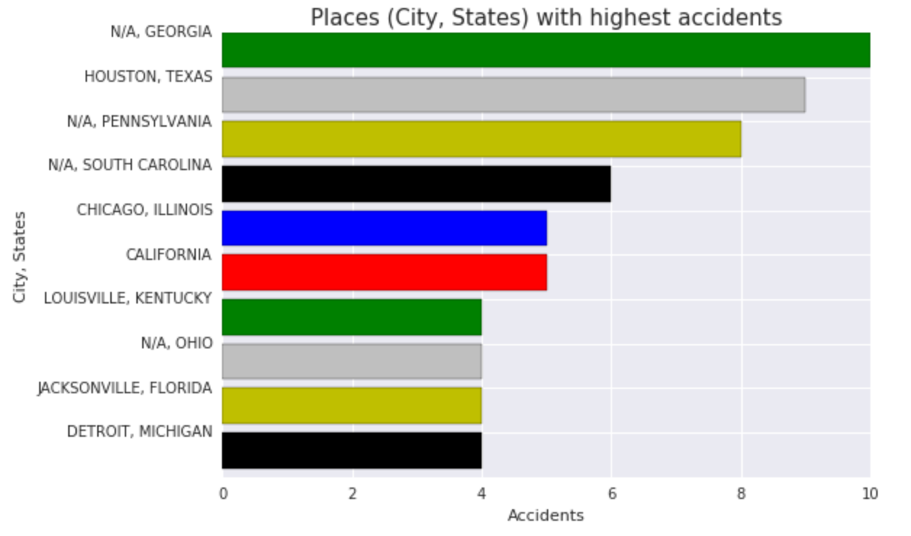
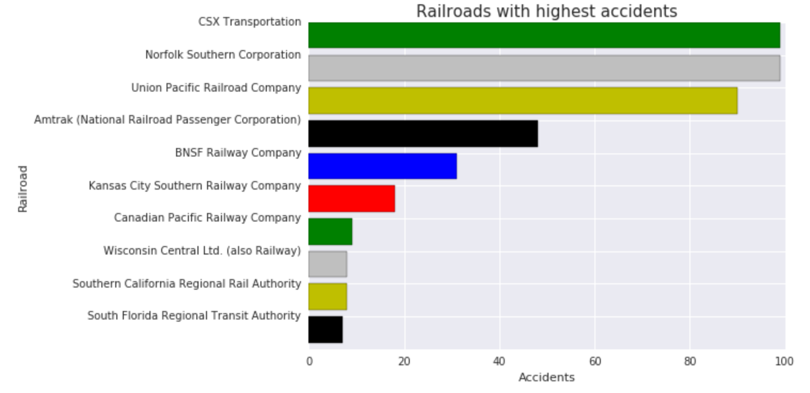

# Train Accidents Analysis - Spark

## Spark Usecase
Use train wreck datasets http://www.trainwreckdb.com with spark to figure out what are the 10 most dangerous places for accidents.

## Jupyter Notebook Link
https://goo.gl/QrBFaS

## Generated Graphs

### Top Dangerous Places

### Top Dangerous Railroads

## Credits

Spark Usecase - http://ranjanr.blogspot.com/2015/12/spark-use-cases.html  
Dataset - http://www.trainwreckdb.com
